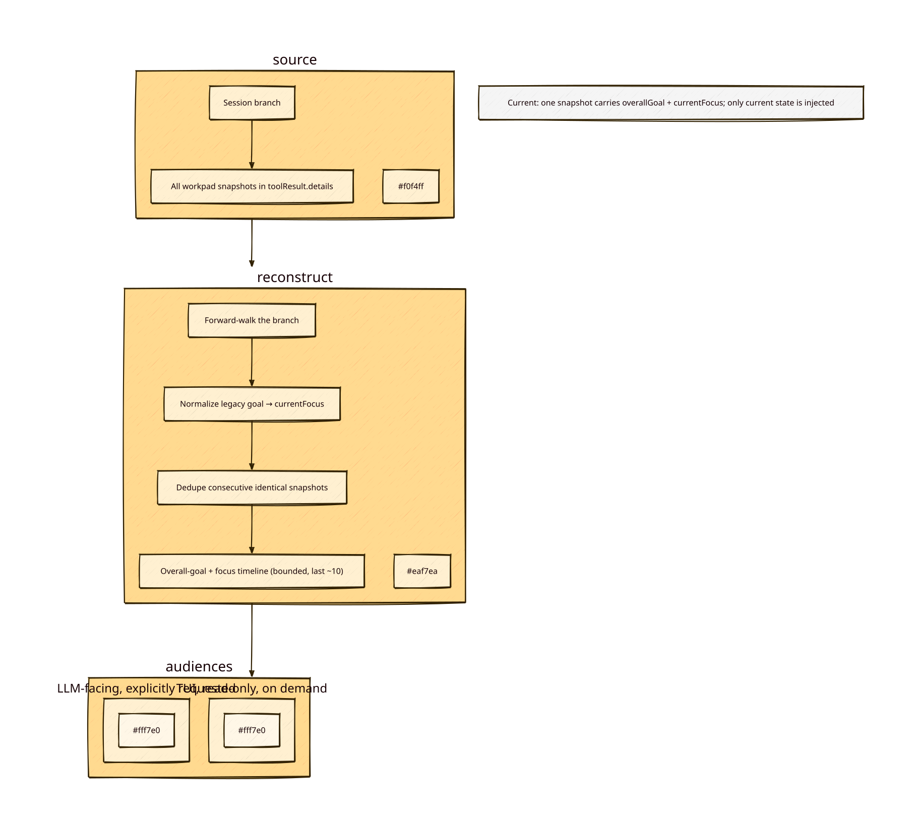

# Goal-history for the workpad — findings & proposal

Status: **v2 implemented** (2026-09-04): the current snapshot separates `overallGoal` (stable umbrella outcome for one session-local work thread) from `currentFocus` (immediate bounded activity), while retaining the read-only history tool and no IDs/restore. Legacy `goal` snapshots normalize only to `currentFocus`, with `overallGoal: null`. Focus-only clear retains `overallGoal`; full clear empties every field. The force-mode gate remains removed pending usage evidence. TDD-first: the new contract was demonstrated red, then 20/20 Vitest tests and `tsc --noEmit` were run green.

> **Historical v1 rationale below:** references to the old overloaded `goal` field and “v1 unchanged” describe the prior design, not the current schema.

## Conclusion

The history feature remains an **LLM-requestable, read-only, work-thread-focused** re-orientation aid. Its earlier evidence exposed a stronger issue: the one current `goal` field collapsed stable intent into tactical focus. The v2 snapshot now keeps both visible on every request; history remains optional and is not auto-injected.

1. A new tool `mini-self-org-history` the model calls *only when it wants* to see how the goal/focus evolved (post-compaction, after long interruptions, before clearing, before starting a "new" goal).
2. A TUI command (`/mini-self-org-history`) sharing the same reconstruction, for resume-after-interruption visibility.
3. Optional, high-signal extra (**v1.1**, no IDs needed): a **goal delta in the update result** (`Goal changed from "<old>"`) — catches drift at the moment of change.
4. **Do NOT** auto-inject history into context — token cost + stale-goal bias + conflicts with the "current state only" contract.

## Problem observed

The `goal` field is used as *current focus + running progress*, and it cascades deep into sub-tasks. The pad only holds the **current** snapshot; there is no way to ask "what was the top-level goal, which sub-task am I in?" History *already exists* (every snapshot is persisted in `toolResult.details.snapshot` in the branch), it is just never surfaced.

### Evidence — 3 top sessions by workpad usage (partner profile, 2026-08-30)

All from `~/.pi/profiles/partner/agent/sessions/--Users-cgint-dev-concepts-homelab--/`:

| Session | Workpad calls | Cascade observed | Outcome |
|---|---|---|---|
| `…16-19-48…` (HA post-cutover) | 35 | `Resolve post-cutover HA issue` → `Fix Victron BLE` stayed ~20 updates deep (incl. SSH host-key detour) | **Recovered** — but only after the *user* re-anchored it; pad was cleared and a new thread started without checking the parent goal |
| `…17-16-05…` (RAID1 copy) | 15 | `Gap analysis` → execution mechanics (`tmux → Herdr pane → workspace`) | **Recovered** after a 2 h interruption by re-reading conversation, not the pad |
| `…12-16-17…` (Pluto cutover) | 12 | `Audit client contracts + remove obsolete NFS` → `HA StaleDataError` diagnosis | **Never returned** to the top-level goal within the session span |

Key facts:

- Recovery to the upper goal, when it happened, came from **live conversation context or the user**, never from the pad. Post-compaction / post-branch-switch that context is gone.
- 3 rejected calls total (schema violations) — model self-corrected within seconds; not a concern.
- "Clears" used `goal: null` as *thread separator*: cleared → 2 min later a new goal started (S1: `Recover lost HA history`). That clear-then-restart is exactly where a parent-goal check would help.

## What the source already provides

- Every update persists a sanitized snapshot into `toolResult.details.snapshot` (branch-local, session-local).
- `reconstructSnapshot` already walks the branch backwards (both `mini-self-org-workpad` and legacy `workpad` names) — a history walk is the same scan **forwards**.
- No new storage, no contract change: history is a **derived, read-only view** of existing data.

## Design proposal

### Tool: `mini-self-org-history`

- Read-only, no parameters (or optional `limit`).
- Returns a **goal-focused timeline**: each distinct goal with timestamp + which fields changed; skip consecutive duplicates; capped (~10–15 entries).
- **Do not filter to "single-value changed"** — in the data, `goal` and `nextActions` change together almost always; a single-field filter would return near-empty exactly when needed.
- Marked non-authoritative in its description (memory aid, not task tracking — consistent with project scope).
- **Naming honesty:** the pad holds a *focus/progress* stream (`ROOT CAUSE CONFIRMED: …`, `DONE`), not a goal hierarchy. The tool surfaces "focus history"; that framing belongs in the description.
- **No snapshot addressing in v1** (IDs + `restore` deferred — see "Deferred" section): entries are identified by timestamp + content.
- Include cleared entries explicitly (e.g. `— cleared —`), since clear-then-restart is an observed pattern.

### Trigger guidance (the real design problem)

Availability ≠ use. Add to `promptGuidelines`: call it *before clearing the pad or starting a "new" goal* (verify the parent thread is actually done), *after context compaction*, and *after long interruptions*.

### Force-mode interaction (removed)

The planned history exemption went with the gate itself: the force-mode feature was never used, adds complexity, and was removed 2026-08-31 by user vote. Re-add only with real usage evidence — its update-act-update-act re-arm rhythm also contradicts the "meaningful state boundaries" doctrine.

### TUI

`/mini-self-org-history` command → same reconstruction → `ui.notify` (or widget later, per the existing "widget is a future optional experiment" note). No token cost.

### Optional (v1.1): goal delta in the update result

When the model changes the goal, the update result text includes `Goal changed from "<old>"` (≤1 line). Bounded, appears once, catches drift one beat earlier than any history request. Keep the "current snapshot" contract — it lives only in the result of the update itself.

## Non-goals / guardrails

- Not project memory, not cross-session task tracking, not a growing log.
- Session/branch-local only (same privacy boundary as the pad).
- Does not replace re-derivation from evidence — it is a re-orientation aid.
- **Partial field ops (append note / remove blocker / item-level edits) — considered, out of scope.** Whole-snapshot replace stays. Rationale: session data shows the model declares full state on every update anyway; partial ops would add a second ID system (per-item IDs) and op-vs-state validation, pushing the pad toward task tracking. Omit-means-keep semantics were rejected as ambiguous ("did I omit to keep, or forget?").
- **Exact-snapshot rollback (`restore` + `mso-wp-N` IDs) — deferred, not v1.** Same start-slow rationale: the model re-anchors from history *content* and composes its own next full-snapshot update; an exact-addressed rollback is speculative complexity until real usage shows it is needed. The escape valve in v1 is: read `mini-self-org-history`, then issue a normal update with the desired state.

## Open questions (deferred, not blockers)

- Cross-session continuity: the `StaleDataError (3 rows)` goal spanned two sessions; a branch-local view can't cover it. Intentionally out of scope.
- Exact cap/shape of the timeline output (goal line + 1 delta line per entry is the working assumption).
- Whether the legacy `workpad` entries should be labelled in the timeline.

## Decisions (2026-08-31)

| # | Decision | Status |
|---|----------|--------|
| 1 | **IDs + one-call restore — DEFERRED (not v1).** Originally agreed as per-branch `mso-wp-N` IDs + `restore:"mso-wp-N"` param; re-scoped after review + "start slow" decision. Rationale: the model re-anchors from history *content* (it will most likely not continue with an exact earlier snapshot, so exact-addressed rollback is speculative); stored IDs break for legacy/pre-feature snapshots, computed IDs risk diverging, and `restore` conflicts with the all-required-fields schema. Deferral dissolves both top review findings. Revisit only if real usage shows repeated "get me back to that exact state" needs. | Deferred |
| 2 | **No mechanical drift detection.** Keep flexibility; the model judges drift. The history diff view supplies the material; nothing prescribes what counts as drift. | Agreed |
| 3 | **Conditional, non-assuming clear-nudge.** Only when the pad had a goal before the clear. Text asks, never asserts a goal/sub-goal hierarchy. | Agreed (v1.1) |
| 4 | **Re-orientation guidance** lives in the `mini-self-org-history` tool description + prompt guideline (call after compaction / long interruptions / before clearing / before starting a "new" goal). | Agreed |
| 5 | **Surgical schema/description edits only.** Minimal wording tweaks; nothing else touched. | Agreed (v1.1) |

## Shape & examples

### Tool: `mini-self-org-workpad` (existing — UNCHANGED in v1)
- Params and result text stay exactly as today. v1 makes **zero changes** to the existing write path — the whole feature is a new read-only tool + command on top.
- The small write-path extras (goal-delta line, conditional clear-nudge, description tweaks) are agreed as **v1.1** quick follow-ups; none of them need IDs:

```
# v1.1 example — goal delta (≤1 line, only when the goal changed):
Workpad updated.
Goal changed from "Fix Victron BLE …" → "Root-cause + fix Victron BLE …".

# v1.1 example — clear-nudge (only when a goal existed; asks, doesn't assume hierarchy):
Workpad cleared.
Previous goal 'Recover lost HA history …' — confirm it's done or carry the remainder forward (check the parent thread via history if unsure).
```

### Tool: `mini-self-org-history` (new, read-only)
- Params: optional `limit` (int, default ~10, cap ~15). No writes.
- Forward branch-walk → dedupe consecutive identical snapshots → goal-focused timeline, each with timestamp + which fields changed; cleared entries marked explicitly. Newest last, capped. Non-authoritative framing in the description. **No IDs in v1** — entries are referenced by timestamp + content.
- Re-orientation guidance (in description + promptGuideline): call after context compaction, after long interruptions, before clearing the pad, or before starting a "new" goal.

Example output:

```
Focus history (branch-local, newest last) — 5 of 33, non-authoritative:
[16:45] goal+nextActions: Fix Victron BLE … (Discovering=false, 0 debug)
[16:48] goal+nextActions: Fix Victron BLE … debug logging active
[16:49] goal+nextActions: Fix Victron BLE (blocked on SSH): determine why 'ssh pluto' fails
[16:50] goal+nextActions: Fix Victron BLE … (reverted, focus restored)
[16:54] goal+nextActions: Root-cause + fix Victron BLE … FOUND: 'bluetooth' adapter …
```

### TUI: `/mini-self-org-history` command
- Read-only, on demand, shares the same forward-walk reconstruction → `ui.notify` (widget stays a future optional experiment). No token cost.

### Deferred: snapshot IDs (`mso-wp-N`) + one-call `restore` (revisit, don't assume)
- Idea: per-branch IDs on accepted snapshots (`mso-wp-1, mso-wp-2, …`; `mso-` prefix to disambiguate from WordPress-style `wp-` tokens) + optional `restore:"mso-wp-N"` on the workpad tool → whole-snapshot copy as new current state.
- Why deferred (review + start-slow decision): stored IDs break for pre-feature/legacy snapshots; computed IDs risk diverging from stored ones; a restore-only call conflicts with the current all-required-fields schema (needs a targeted schema change); and it adds a whole addressing mechanism before the plain history tool has proven useful in practice.
- Re-entry trigger: real usage shows the model repeatedly needing "get me back to that exact state" and the two-call path (read history → normal full-snapshot update) is visibly awkward.
- Feasibility note (kept for the eventual revisit): tool `execute(toolCallId, params, signal, onUpdate, ctx)` receives `ctx`, so branch access is available in tools — verified against Pi SDK docs.

## Next steps (when implementing)

**v1 (minimal, purely additive — zero changes to the existing write path):**

1. TDD: `reconstructHistory(ctx, limit?)` returning distinct snapshots with change markers (unit tests on synthetic branches, including legacy + cleared entries + dedupe). No IDs.
2. Register `mini-self-org-history` tool (read-only, capped, non-authoritative) + re-orientation prompt guidance.
3. Add `/mini-self-org-history` TUI command (shared reconstruction).

**v1.1 (small, no IDs needed — do once v1 is in practice):**

4. Optional: goal-delta line in the update result (compare against previous snapshot; one line).
5. Conditional clear-nudge line in the clear result (only when a goal existed; ask, don't assert hierarchy).
6. Surgical description tweaks (brief state, not an essay; skip update if nothing changed).

**Deferred (only if the re-entry trigger fires — see Deferred section):**

7. `mso-wp-N` IDs + `restore` param (schema change required; see Deferred notes).

## Diagram


